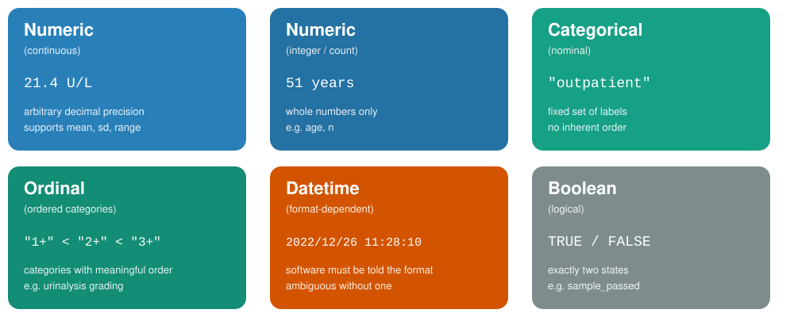
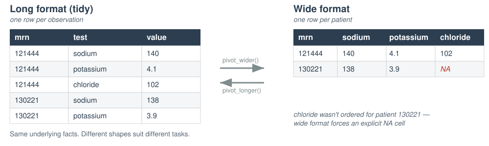

## Disclosure of Relevant Financial Relationships

The faculty, committee members, and staff who are in position to control the content of this activity are required to disclose to MSACL and to learners any financial relationships that have occurred within the last 24 months with ineligible companies whose primary business is producing, marketing, selling, re-selling, or distributing healthcare products used by or on patients. MSACL has reviewed the disclosures and mitigated all relevant financial relationships.

You can view the financial disclosures of any Steering / Scientific Committee Member or Podium Presenters (except for Industry Workshops, which do not qualify for CME credit) on the MSACL website directly underneath the person's name. Click "Review Relevant Financial Disclosures".

MSACL staff associated with the development of content for this activity report no relevant financial relationships.

::: {.notes}
This slide must be included in the deck WITHOUT MODIFICATION. Relevant Financial Relationships are declared on the following slide.
:::

---

## Relevant Financial Relationships

| Company | Relationship | Ended? |
| --- | --- | --- |
| None |  |  |
|  |  |  |
|  |  |  |

---

## Module 1 Learning Objectives

By the end of this module, you will be able to:

- Situate data literacy within the broader landscape of data science and analytics as practiced in the clinical laboratory
- Distinguish common data types and explain why type matters for downstream analysis
- Identify whether a dataset follows tidy data principles — and articulate the tradeoffs
- Recognize common data quality issues and their downstream consequences

<div class="pillars">
<div><h4>Context</h4><p>Where does this fit in data science?</p></div>
<div><h4>Types</h4><p>What can this value even do?</p></div>
<div><h4>Structure</h4><p>How easy is this to work with?</p></div>
<div><h4>Quality</h4><p>Can I trust this answer?</p></div>
</div>

---

## The DIKW Pyramid

Data is synthesized into information, then knowledge — and knowledge, in turn, can drive decision-making.

- **Data** — raw observations, recorded systematically
- **Information** — data organized to answer a specific question
- **Knowledge** — information connected to context and experience
- **Wisdom** — knowledge applied to make a sound decision

<p class="lead">Everything in this course lives at the base of this pyramid — but the whole point of building a solid base is what it lets you build on top of it.</p>

---

## What Is Data Science?

- Interdisciplinary field that uses computational methods, statistics, and broad analysis techniques (including visualization) to extract knowledge from data
- Draws on a variety of academic disciplines, including mathematics, statistics, computer science, and information science/informatics
- Critical to integrate domain knowledge: laboratory medicine

---

## Computational Tools Support a Broad Data Lifecycle

Data science extends beyond *analysis* of data and includes considerations for *capturing* and *maintaining* data.

- Capture — how data enters a system in the first place
- Maintain — storage, structure, and quality over time
- Analyze — the stage most people think of as "data science," but only one part of the lifecycle

<p class="lead">Source: <em>ischoolonline.berkeley.edu/data-science/what-is-data-science</em></p>

---

## Statistics Helps Us Interpret Data Based on Expectations

- Many categories of numeric lab data can be described by known distributions, e.g. the normal distribution
- Statistical methods allow us to evaluate hypotheses about the data
  - Does the data fit a normal distribution? If not, why not?
  - Are the differences between these sets of observations significant?

::: {.notes}
Statistics can also be applied to non-numeric data — e.g. analysis of how words are used in clinical notes, and deriving methods to extract useful information from them.
:::

---

## Data Analytics Is a Subset of Data Science

Data analytics includes discovering useful information and conclusions to support decision-making from data:

- Using real-world data
- Visualization
- Statistical and exploratory analysis
- Machine learning
- Communicating results

---

## Data Science Can Be Categorized by How the Data Is Applied

| Quadrant | Question | Time Orientation |
| --- | --- | --- |
| **Descriptive** | What is happening? | Right now / recent past |
| **Diagnostic** | Why is it happening? What are the root causes? | Recent past |
| **Predictive** | What will happen? When might it happen? | Future |
| **Prescriptive** | What should we do? | Integrates predicted and past |

---

## Descriptive Analytics Are Becoming More Common Across Healthcare Settings

Example: a DLMP Quality Assurance Dashboard — surfacing current and recent-past lab performance metrics for ongoing monitoring.

---

## Predictive Analytics Are Emerging in Multiple Domains

Example: a UWMC Phlebotomy Prediction model — using historical patterns to anticipate future draw volume.

---

## What Is the Role of the Laboratorian?

- Define the important problems to solve and/or questions to answer
- Subject matter expert: those generating the data best understand the data
- Perform and interpret routine analyses (e.g. quality control)
- Support the validation of analyses done by others
- Develop and/or perform new analyses for quality improvement

<p class="lead">Data science tools are only as good as the domain expertise that directs them — and in the clinical lab, that expertise is yours.</p>

---

## 1.1 What Is Data? {background-color="#2c3e50"}

<p class="subtitle">Before we touch R, we need a shared vocabulary for what we're even looking at</p>

---

## What Is Data?

- **Data** = observations recorded systematically
- Every value in a dataset represents something measured, reported, or logged in the real world
- Two categories worth separating:
  - **Raw data** — recorded as originally captured (an instrument reading, a timestamp)
  - **Derived data** — calculated or transformed from raw values (a turnaround time, a mean)

> If you can't say what real-world event a value represents, you don't yet understand your data.

---

## Data Representation

Data representation is the assignment of meaning to physical artifacts — characters, numbers, words, phrases — as electronic states of computer memory.

- **Unstructured data** (human language): extremely flexible; form and usage vary with location and time; context-dependent
- **Structured data**: constrained language; well-defined syntax and semantics
- A **data standard** is a formal agreement on data representation — the thing that allows data to be shared and interoperate across systems

::: {.notes}
Pre-computer, "data representation" usually meant visual artifacts. Data standards are what allow sharing and interoperability. Source: Siriyasatien et al., IEEE Access 2018, doi:10.1109/ACCESS.2018.2871241. © 2023 James H. Harrison, Jr.
:::

---

## Why Structure Matters — Before Any Analysis

- The same facts can be organized many different ways
- Structure determines:
  - What questions are *easy* to answer
  - What questions are *possible* to answer at all
  - How easily errors are introduced or hidden
- We'll return to this directly in section 1.3 (Tidy Data)

<p class="lead">Structure is a decision you make — not a fact about the data itself.</p>

---

## 1.2 Data Types {background-color="#2c3e50"}

<p class="subtitle">Six categories cover almost everything you'll encounter in clinical and MS data</p>

---

## Why Data Types Matter

A data type isn't just a technical label — it determines:

- What operations are valid (can you average it? sort it? subtract it?)
- How software will interpret ambiguous values
- Whether a value like `"NA"` means *missing* or literally the state of Nebraska

Misidentifying a type is one of the most common — and most silent — sources of analysis errors.

> A wrong data type doesn't crash your code. It just quietly gives you the wrong answer.

---

## Common Data Types

{fig-align="center" width="92%"}

::: {.notes}
Walk through each card briefly rather than reading it verbatim — ask learners to shout out which chem_data column they think matches each card.
:::

---

## Poll: How Many Ways Can "100" Be Represented in a Computer?

<p class="lead">Take a moment before the next slide — how many representations can you think of?</p>

---

## Representation Has Functional Implications

All representations of a number are ultimately binary — but the *form* matters:

- **Integer** — can't divide with a decimal result or include directly in text
- **Floating point** — inexact, can't include directly in text
- **Character string** — can't do math without conversion

<p class="lead">Medical systems often represent numbers as text: it saves space for usual-sized numbers, display is often the primary purpose, and math is converted only when needed.</p>

::: {.notes}
© 2023 James H. Harrison, Jr.
:::

---

## A Special Case: Censored / Below-LOD Values

::: columns
::: {.column width="55%"}
- Clinical and MS data often contain values reported as **"<0.5"** or **"undetectable"**
- These are not missing — they are a special type: **censored data**
- The true value is known to be *somewhere below a threshold*, not unknown entirely
- Treating a censored value as missing (or worse, as zero) can distort every downstream summary statistic

::: {.callout-note}
We will not perform formal censored-data statistics in this course — but recognizing these values when you see them is essential data literacy.
:::
:::
::: {.column width="45%"}
{fig-align="center" width="100%"}
:::
:::

---

## Types in the Wild: A Raw CSV Row

```
121444,"Male",44,NA,2022-12-26 00:24:02,2022-12-26 01:58:16,
2022-12-26 03:42:19,NA,"unassigned","lopez","alanine_aminotransferase",17
```

- No column tells you the type — you have to infer it from the value and context
- `NA` appears twice, but for two different reasons
- The datetime has no explicit format label — R will have to be told how to read it (Module 2)

<p class="lead">Every column in this row is a small decision you'll have to make deliberately.</p>

---

## Data Frames

- A **data frame** is a two-dimensional collection of heterogeneous data
- Spreadsheet-like data — typically organized in columns with a fixed data type
- Columns (or variables) are often explicitly named

| Identifier | Location | Test | Value |
| --- | --- | --- | --- |
| F123456 | Inpatient | Sodium | 140 |
| W987654 | Outpatient | Potassium | 4.8 |
| X234537 | ED | AST | 70 |

<p class="lead">Everything you'll do in R starts from data shaped like this.</p>

---

## Before We Start: Orienting in RStudio

This module has **no R code** — but we'll still work inside RStudio.

Today, RStudio is simply a **text editor**: a place to open files, read them carefully, and record your answers.

1. Open the course project — double-click the `.Rproj` file
2. In the **Files** pane, open `updates_2026/exercises/module_1_exercises.qmd`
3. This file opens in the **Source** pane — you'll type your answers directly into it
4. Save often (Cmd/Ctrl+S) — nothing here runs or executes

> Getting oriented now — before anything needs to *run* — is what makes Module 2 feel easy instead of overwhelming.

::: {.notes}
Emphasize: opening the .Rproj first matters because it sets the working directory correctly for every later module. This is the seed that pays off in Module 2 when relative paths need to work.
:::

---

## Why RStudio — Even for a Non-Coding Module?

- One consistent home for course materials, exercises, and (soon) code
- The **Source** pane doubles as a plain-text and Markdown editor
- Getting comfortable navigating panes *before* you need to run anything lowers the stakes
- Module 2 will introduce RStudio as a *computational* tool — today is just geography

<div class="pillars">
<div><h4>Today</h4><p>RStudio as a text editor — read, navigate, record answers</p></div>
<div><h4>Module 2+</h4><p>RStudio as a computational tool — import, transform, visualize</p></div>
</div>

---

## → Check-in 1A: Spot the Types {background-color="#8e44ad"}

<div class="badge">⏱ 10 minutes</div>

Open `chem_data.csv` in a plain text editor (not RStudio — a real text editor).

For each of the 13 columns, predict the data type and flag any concerns.

- Which columns look **numeric** vs. **categorical**?
- Where might **censored** or **missing** values be hiding?
- Which column will need an explicit **datetime format**?

*Return to `module_1_exercises.qmd` in RStudio to record your answers.*

---

## 1.3 Tidy Data Principles {background-color="#2c3e50"}

<p class="subtitle">The same facts, organized differently, can make an analysis easy or nearly impossible</p>

---

## Three Principles of Tidy Data

A dataset is **tidy** when:

1. Every **variable** has its own column
2. Every **observation** has its own row
3. Every **value** has its own cell

- Not a matter of taste — a precise, checkable definition
- Most tidyverse tools *assume* tidy input

> Tidy data isn't prettier data. It's data shaped for the tools you're about to use.

---

## The Same Facts, Two Structures

{fig-align="center" width="95%"}

Same information — very different shapes. Notice the explicit `NA` that appears only once the data is widened.

---

## Tradeoffs: Long vs. Wide

| | Long (tidy) | Wide |
|---|---|---|
| Add a new analyte | Add rows | Add a column, restructure |
| Filter by analyte | Easy (`filter()`) | Awkward |
| Human-readable summary table | Harder to scan | Easy to scan |
| Feed into `ggplot2` | Usually required | Usually needs reshaping first |

- **Neither format is "wrong"** — but one is almost always easier for a given task
- The tidyverse gives you tools (`pivot_longer()`, `pivot_wider()`) to convert between them — we'll see these in Module 4

---

## Tidy Data Summarized

A dataset is tidy if:

- Each **variable** is in its own column
- Each **observation** is in its own row
- Each **value** is in its own cell

<p class="lead">MRN, test, value, and every other measured fact each get their own column — and every patient/analyte combination gets its own row.</p>

::: {.notes}
Wickham, H. (2014). Tidy Data. Journal of Statistical Software, 59(10), 1–23.
:::

---

## → Check-in 1B: Tidy or Not Tidy? {background-color="#8e44ad"}

<div class="badge">⏱ 8 minutes</div>

Compare `chem_data.csv` (long) and `chem_data_wide.csv` (wide).

Answer three written questions in `module_1_exercises.qmd`:

- Which tidy principle does the wide format bend?
- When is each format easier to use?
- What would you need to do to a wide file before analyzing it in R?

---

## 1.4 Data Quality and Common Pitfalls {background-color="#2c3e50"}

<p class="subtitle">Plausible-looking data is not the same thing as trustworthy data</p>

---

## Data Quality

| Dimension | Question |
| --- | --- |
| **Completeness** | Is data present and available? |
| **Correctness** | Is data true? |
| **Concordance** | Is there agreement and consistency between data elements? |
| **Plausibility** | Does data make sense in the clinical context? |
| **Currency** | Is data a relevant representation at a defined point in time? |

::: {.notes}
Weiskopf NG, Weng C. Methods and dimensions of electronic health record data quality assessment: enabling reuse for clinical research. J Am Med Inform Assoc. 2013;20(1):144-151. doi:10.1136/amiajnl-2011-000681. © 2023 James H. Harrison, Jr.

Why is data quality important for computers? Humans become conservative when data is uncertain and the stakes are high; computers don't, unless programmed to. Handling uncertainty and incorporating low quality into a result means the result quality may reflect the lowest-quality input — garbage in, garbage out.
:::

---

## Common Data Quality Issues

- **Missing values** — and knowing *why* they're missing (not tested vs. not applicable vs. lost)
- **Duplicate rows** — same observation recorded more than once
- **Out-of-range values** — a pH of 45, an age of 200
- **Encoding inconsistencies** — `"Male"` vs. `"M"` vs. `"male"` treated as three different categories
- **Timestamp errors** — a verify time earlier than the collect time

<p class="lead">Each of these can silently corrupt a downstream summary — often without any error message.</p>

---

## Why "Silent" Errors Are the Dangerous Ones

- Software rarely stops and warns you when data is *plausible but wrong*
- A mis-encoded category doesn't crash your analysis — it just quietly gets excluded, or double-counted
- This is exactly why Module 2 introduces a **validation checklist** as a required first step, every time you import data

> The most dangerous bugs are the ones that produce an answer — just the wrong one.

---

## Bringing It Together

<div class="pillars">
<div><h4>Data types</h4><p>Determine what's even <em>possible</em> to compute</p></div>
<div><h4>Tidy structure</h4><p>Determines what's <em>easy</em> to compute</p></div>
<div><h4>Data quality</h4><p>Determines whether your answer is <em>trustworthy</em></p></div>
</div>

<p class="lead">Three habits. Zero lines of R code. All essential before you ever open a script.</p>

---

## Coming Up: Module 2

- RStudio as a **computational** tool, not just a text editor
- How to set up a project so your code runs the same way on any machine
- Importing `chem_data.csv` with the tidyverse
- Correcting the types you predicted today
- A hands-on data validation checklist

<p class="lead"><strong>Bring your laptop, charged, with R and RStudio installed.</strong></p>

---

## References & Acknowledgements

- James Harrison, *Introduction to Pathology Informatics*, Session 8: Cybersecurity, API Distribution 1.0, 2023. Available at: https://www.pathologyinformatics.org/teaching-slide-sets
- Robert Benirschke & Chris McCudden for slides adapted from ADLM Data Science Certificate materials
