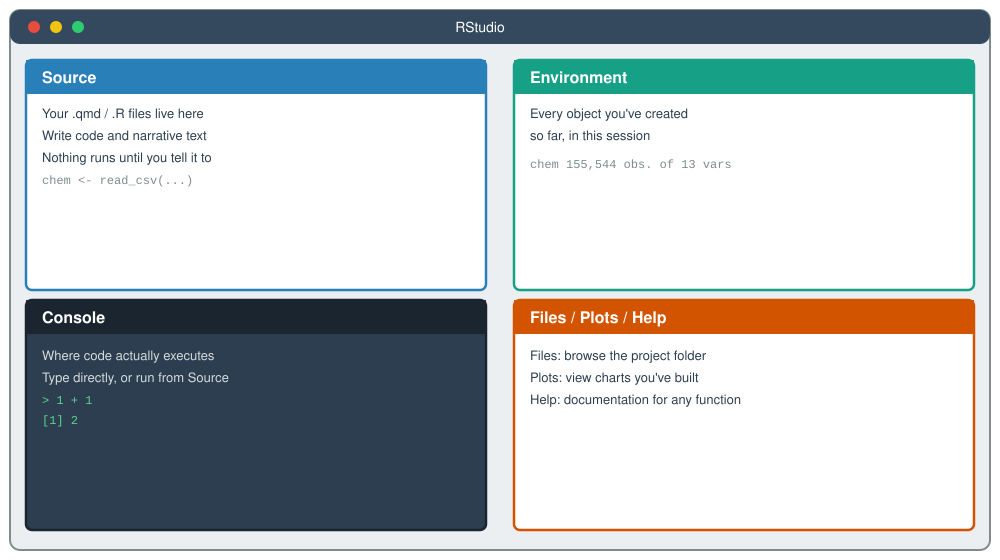
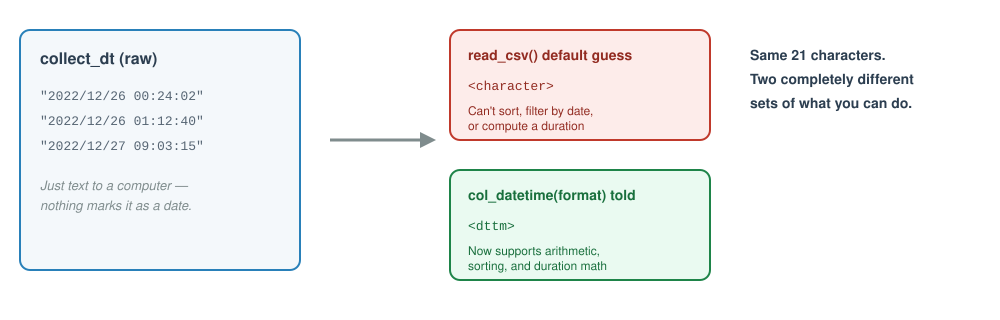
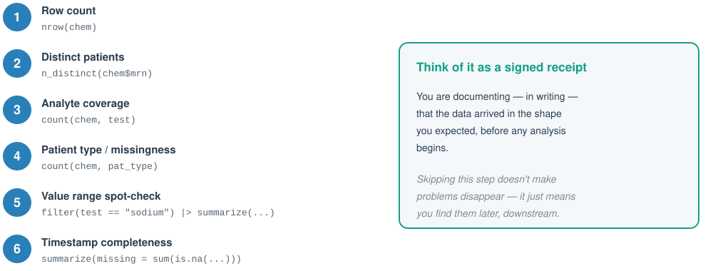

## Welcome Back

- Module 1 gave you the vocabulary: **types**, **structure**, **quality**, **organization**
- Today, those ideas become *operational* — RStudio moves from a text editor to a computational tool
- We'll import real data, inspect it, and validate it before drawing a single conclusion

<p class="lead">Today's question: can we trust this dataset enough to build on it?</p>

::: {.notes}
Callback to Module 1's closing slide: today is where the "four habits, zero lines of R code" finally meet actual R code.
:::

---

## Module 2 Learning Objectives

By the end of this module, you will be able to:

- Navigate the RStudio interface and explain the purpose of each pane
- Apply project and file organization principles for a reproducible analysis
- Import and inspect a dataset using the tidyverse
- Recognize and correct common data type misassignments
- Apply a systematic data validation checklist after importing data

<div class="pillars">
<div><h4>Interface</h4><p>Where do things happen, and why does it matter?</p></div>
<div><h4>Organization</h4><p>A project file so your code runs anywhere</p></div>
<div><h4>Import</h4><p>Getting data in — correctly, not just successfully</p></div>
<div><h4>Types</h4><p>Catching R's wrong guesses before they cost you</p></div>
<div><h4>Validation</h4><p>Proving the data is what you think it is</p></div>
</div>

---

## 2.1 Why Use a Programmatic Tool? {background-color="#2c3e50"}

<p class="subtitle">What a script can do that a spreadsheet cannot</p>

---

## From Cells to Operations

- A spreadsheet asks: *what value goes in this cell?*
- A script asks: *what operation transforms this whole dataset?*
- That shift — from individual cells to systematic operations — is the mental model this entire course is built on

<p class="lead">You are no longer editing values. You are describing a process.</p>

::: {.notes}
This is the pivot point of the whole course. Don't rush it — ask learners what "operation" means to them before naming filter/mutate/etc. (those come in Module 4).
:::

---

## Why It Matters: Reproducibility, Auditability, Scale

- **Reproducibility** — the same script run twice on the same data gives the same answer, every time
- **Auditability** — every step is written down; no one has to guess what you clicked
- **Scale** — a script that works on 100 rows works identically on 10 million

> A spreadsheet remembers your last click. A script remembers your entire reasoning.

---

## What This Looks Like in Practice

| | Spreadsheet | Script |
|---|---|---|
| Repeat an analysis next month | Redo every click | Re-run the file |
| Explain what you did | Try to recall | Read the code |
| Catch a mistake | Hope someone notices | Re-run and compare |
| Hand off to a colleague | Walk them through it live | Send the file |

<p class="lead">None of this requires you to be a "programmer" — it requires you to write down what you did.</p>

---

## → Check-in 2A: RStudio Orientation {background-color="#8e44ad"}

<div class="badge">8 minutes</div>

1. Open the course `.Rproj` file from your file system
2. In the **Console**, type `1 + 1` and press Enter — confirm you see `[1] 2`
3. Return to `module_2_exercises.qmd`, run the setup chunk

Fill in the RStudio Panes table and answer three written questions in the exercise file.

---

## 2.2 R Basics: Objects, Functions, and Packages {background-color="#2c3e50"}

<p class="subtitle">The four ideas everything else in this course builds on</p>

---

## The RStudio Interface, at a Glance

{fig-align="center" width="92%"}

::: {.notes}
Point out that this matches exactly what learners just saw on their own screen during Check-in 2A — this slide is a labeled recap, not new information.
:::

---

## Objects: Naming a Result So You Can Reuse It

- `<-` assigns a value to a name — `chem <- read_csv(...)` means "call this result `chem`"
- Once assigned, an object shows up in the **Environment** pane and can be reused in any later chunk
- Assignment is how a script *remembers* — a spreadsheet has no equivalent concept

```
chem <- read_csv("data/chem_data.csv")
```

<p class="lead">Every object is a named, reusable answer to a question you already asked.</p>

---

## Functions: Verbs That Act on Objects

- A **function** takes input, does something to it, and returns a result — `nrow(chem)`, `mean(x)`, `read_csv(path)`
- Functions are *verbs*; objects are *nouns* — nearly all R code is some combination of the two
- You don't need to know how a function works internally to use it correctly

> If you can name what you want to happen to your data, there is very likely already a function for it.

---

## Packages: Bundled, Reusable Tools

- A **package** is a collection of functions written and shared by someone else, so you don't reinvent them
- `library(tidyverse)` loads the one package family this entire course relies on
- Packages must be installed once, but *loaded* (via `library()`) every new session

<p class="lead">Almost every function you'll type this week comes from a package someone already built and tested.</p>

::: {.notes}
Keep this brief — MSACL 101 goes deeper into package management and installation troubleshooting. This is orientation, not mechanics.
:::

---

## RStudio Needs a "Point of Reference"

- Every time R reads or writes a file, it looks relative to one location: the **working directory**
- Write `"data/chem_data.csv"` and R has to guess *which* `data/` folder you mean — it guesses based on the working directory, not where the file "obviously" is
- No defined point of reference means the same code can run on your laptop and fail on a colleague's — or fail on your own machine next month
- This is exactly why you opened the `.Rproj` file first in Check-in 2A, before touching any code

> A script that only runs from your Desktop isn't reproducible. It's just accidentally correct on your computer, today.

::: {.notes}
Callback directly to Check-in 2A: learners already opened the .Rproj file — now they learn *why* that step mattered. Most import errors trace back to this concept, so land it solidly here.
:::

---

## RStudio Projects Fix the Problem

- An **`.Rproj` file** marks a folder as a *project* — opening it tells RStudio "set the working directory here, every time"
- Every relative path in your code (`data/chem_data.csv`) is now anchored to that project folder, regardless of whose computer it lives on
- This is *why* every exercise in this course starts with "open the `.Rproj` file" — not the script, not the `.qmd` — the project file first
- Combined with a consistent folder structure, this is what makes an analysis **portable**: it runs the same way on any machine

<p class="lead">The folder structure on the next slide only pays off once a project file anchors it.</p>

---

## A Simple, Durable Folder Structure

{fig-align="center" width="88%"}

- **`data/` is read-only, in spirit** — never overwrite or edit a raw file by hand
- The `.Rproj` file anchors all relative paths so your code works regardless of where the folder lives on disk

---

## 2.3 Importing Data with Explicit Column Types {background-color="#2c3e50"}

<p class="subtitle">R has to guess at every column's type — and sometimes it guesses wrong</p>

---

## `read_csv()` and the Type-Guessing Problem

- `read_csv()` reads the first ~1,000 rows and *guesses* each column's type from what it sees
- That guess is often reasonable — and sometimes exactly wrong, especially for dates and categories
- A column of `"2022/12/26 00:24:02"` values has no built-in marker that says "I am a datetime"

<p class="lead">A wrong guess doesn't throw an error. It just quietly limits what you can do next.</p>

---

## Same Text, Two Very Different Outcomes

{fig-align="center" width="94%"}

::: {.notes}
This is the direct payoff of Module 1's "why data types matter" section — connect explicitly if learners don't make the link themselves.
:::

---

## Telling R What You Already Know

- `col_types = cols(...)` lets you specify the type for every column explicitly, rather than trusting the guess
- `col_datetime("%Y/%m/%d %H:%M:%S")` — you supply the *exact* format the raw text is in
- `col_factor()` — for a column with a fixed, known set of category labels (like `pat_type` or `gender`)

```
collect_dt = col_datetime("%Y/%m/%d %H:%M:%S")
pat_type   = col_factor()
```

<p class="lead">You are not fighting R's guess — you're replacing a guess with a fact you already know.</p>

---

## → Check-in 2B: Import and Inspect chem_data {background-color="#8e44ad"}

<div class="badge">20 minutes</div>

**Part 1:** Import with default types. Run `glimpse()` and `summary()` — identify which columns look wrong.

**Part 2:** Re-import with explicit `col_types`. Fill in two blanks: the datetime format string, and the `col_` function for `pat_type`. Confirm the corrections.

---

## 2.4 Data Validation Checklist {background-color="#2c3e50"}

<p class="subtitle">Before you analyze anything, prove it arrived the way you expected</p>

---

## Why Validation Comes First — Every Time

- A successful import is not the same thing as a *correct* import
- Validation catches problems while they're still cheap to fix — before they're buried inside a summary table or a chart
- This is the direct continuation of Module 1's "silent errors" idea: validation is how you make silent errors loud

> An import that runs without an error message has told you nothing about whether the data is right.

---

## The Six-Step Checklist

{fig-align="center" width="96%"}

---

## What a Failed Check Actually Tells You

- **Row count off?** You may have imported a stale file, or a filter ran earlier than intended
- **Analyte counts uneven?** Some analytes may only be ordered for certain patient types — is that expected?
- **Missing timestamps?** Is that a data entry gap, or a real workflow state (e.g., not yet verified)?

<p class="lead">Every checklist item ends in the same question: is this what I expected, and if not, why not?</p>

::: {.notes}
Emphasize that "the number looks fine" is not the same as "I interpreted the number." The written interpretation in Check-in 2C is the actual skill being taught, not the code.
:::

---

## → Check-in 2C: Run the Checklist {background-color="#8e44ad"}

<div class="badge">15 minutes</div>

Step through all six validation checks on the correctly imported `chem_data`. Record your interpretation of each result — not just the number, but what it means.

**Closing question:** identify one data quality issue you'd want to investigate further before presenting results to a lab director.

---

## Bringing It Together

<div class="pillars">
<div><h4>Interface</h4><p>Source writes, Console runs, Environment remembers</p></div>
<div><h4>Organization</h4><p>The .Rproj file anchors every relative path</p></div>
<div><h4>Import</h4><p>Tell R the types — don't trust the guess</p></div>
<div><h4>Validation</h4><p>A receipt that the data is what you expect</p></div>
<div><h4>Mindset</h4><p>Reproducible, auditable, and built to scale</p></div>
</div>

<p class="lead">You now have a validated, correctly typed dataset. Module 3 puts it on screen.</p>

---

## Coming Up: Module 3

- Visualization principles and best practices
- Choosing the right chart for the question you're asking
- Building and refining plots with `ggplot2`
- A first look at code you won't fully understand yet — and that's intentional

<p class="lead"><strong>Bring the validated chem_data import from today — Module 3 builds directly on it.</strong></p>
