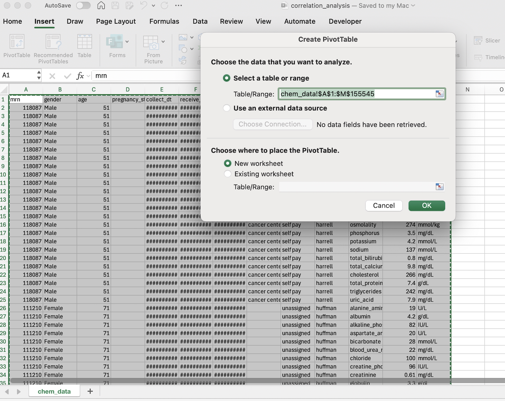
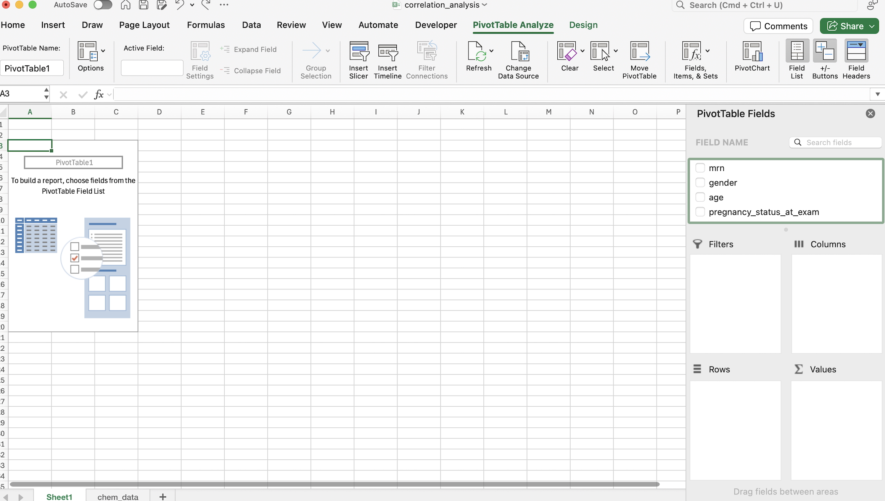
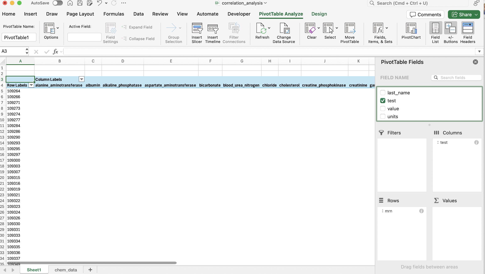
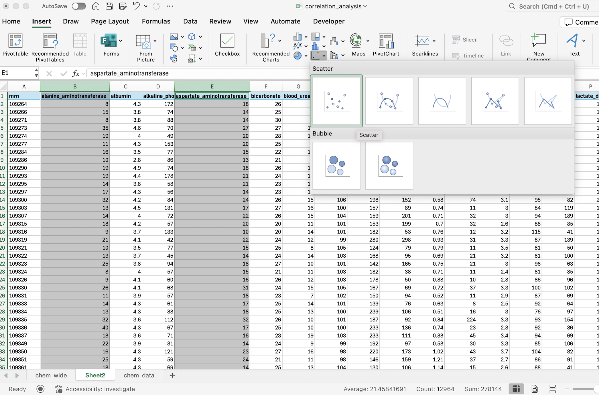

# Exercise 1: Chemistry data set orientation

In this lesson we will work with different data sets that align with different statistical questions or approaches that you may encounter in a clinical lab. The first data set is derived from a publicly available data set from the National Health and Nutrition Examination Survey (NHANES), which includes routine clinical chemistry testing from healthy individuals. Synthetic clinical information has been integrated with the data to more closely align with what you may see in a laboratory information system. Let's take a brief look at the data by opening up the **chem_data.csv** file in the data folder.

1.  What does each row contain? (i.e. what is the unit of observation?)
2.  How many observations are there?
3.  What steps would you take to review data for only one analyte within the data set?
4.  Click Save As... in the File menu.
5.  Within the Save As window, if it is not already created, create a new folder called "output" within the MSACL-data-literacy folder. Select the new folder.
6.  Save the file as an Excel file named **stat_summary.xlsx** within the output folder.
7.  Using the Filter function from the Sort & Filter menu, create a subset of only the sodium values in the data set and save the data to a separate sheet called "sodium".
8.  Calculate the mean, median, and mode for the sodium values in the data set.
9.  Calculate the standard deviation and coefficient of variation (CV).
10. Is the sodium data normally distributed? How might you assess this informally?

# Analysis in R

```{r}
library(tidyverse)
library(DescTools)

chem_data <- read_csv("../data/chem_data.csv")
head(chem_data, 10)
sodium_data <- chem_data |> 
  filter(test == "sodium")
sodium_summary <- sodium_data |> 
  summarize(mean_sodium = mean(value),
            median_sodium = median(value),
            mode_sodium = Mode(value), # note that mode is in the DescTools package
            std_dev_sodium = sd(value),
            cv_sodium = (std_dev_sodium/mean_sodium)*100)
sodium_summary
```

```{r}
ggplot(sodium_data, aes(x = value)) +
  geom_histogram(binwidth = 1) +
  theme_bw()
```

# Exercise 2: Performing a one-sample t-test

For some categories of population-level studies, you may have a collection of observations and known population-level statistics for a group of interest. You can assess whether the mean of your sample is different than the known mean of a population using a 1 sample t-test. This may be helpful to answer the question of whether a selected population, for example to derive an indirect reference interval, aligns with a healthy population that a broad study like NHANES has collected routine lab data for. (Note this is perhaps an over-simplification as other considerations such as testing methods may impact the measured values.) In this exercise we will compare the mean for cholesterol of a subset of our chemistry data set with the known population mean.

1.  With the **chem_data.csv** file open in Excel, click the File menu (top left) and click "Save As..." A best practice when working with data is to leave your raw data unaltered and create a new file for an analysis.

2.  Use Save As... to save a new file "outpt_cholesterol" and as an Excel file (.xlsx) using the File Format dropdown menu, to the output folder.

3.  Press the square between the column A and row 1 to select the whole data set.

4.  Locate the Sort & Filter button and hit the down arrow, then select Filter.

5.  Use the filter arrow for the pat_type variable to select just the observations for outpatient samples.

6.  Use the filter arrow for the test variable to select the observations for cholesterol.

7.  Select the whole data set by clicking on the top left corner and copy it (Command/Control + C).

8.  Click the plus sign at the bottom of the window to create a new sheet and name it "outpt_cholesterol". Click the top left square (between column A and row 1) and paste the data set in.

9.  In cell O1 add a new header "average". In rows 2 and 3, enter the mean cholesterol value 190.

10. Select the Data menu (at the top) to view different analysis options.

11. If you do not see an option for "Data Analysis" on the far right, click the Analysis Tools option and select the Analysis Toolpak option.

12. Now click Data Analysis and select "t-Test: Two-Sample Assuming Unequal Variances".

13. For Variable 1 Range select the values in column L (click cell L2, scroll down to find the last value in the column, hold shift, then click the last cell).

14. For Variable 2 Range select the 2 values in column O.

15. Under Output Options, "New Worksheet Ply:" should be selected by default. Enter "one var t-test" in the text box to name the new worksheet.

16. What does the output tell you?

# One sided t-test in R

This set of operations is very straightforward in R:

```{r}
library(infer)
outpt_chol <- chem_data |> 
  filter(pat_type == "outpatient", test == "cholesterol")
# stores outpatient cholesterol observations in a new data frame outpt_chol
t_test(outpt_chol, response = value, mu = 190)
```

# Exercise 3: Performing a two-sample t-test

A common scenario is the need to compare two groups and assess whether the means are equal. In this exercise we will compare the mean iron value for males and females in this data set to assess whether they are different.

1.  Re-open your **chem_data.csv** file in Excel and use "Save As..." to create a new file "iron_comparison" as a .xlsx file. Save this in the *output* folder. Remember to always separate your analysis from your raw data!
2.  Select the whole data set and use the Filter option to allow you to select a subset of the data.
3.  Use the filter arrow next to the test variable to subset just the iron results.
4.  Use the filter arrow for the pat_type variable to select just the observations for outpatient samples.
5.  Using the down arrow next to the gender variable, sort the data by clicking the Descending button under the Sort options. We now can select the data for males separately than the data for females.
6.  Copy the data set that you've filtered and sorted into a new worksheet named "iron data".
7.  Navigate to the Data menu and click "Data Analysis".
8.  Select "t-Test: Two Sample Assuming Unequal Variances" to open up the analysis window.
9.  For Variable 1 Range, select the values for just the Male observations.
10. For Variable 2 Range, select the values for just the Female observations.
11. Under Output Options, "New Worksheet Ply:" should be selected by default. Enter "two var t-test" in the text box to name the new worksheet.
12. What is the mean value for males? For females? What do the t-statistic and p-value suggest?

# Two sided t-test in R

```{r}
iron_subset <- filter(chem_data, test == "iron", pat_type == "outpatient")
t_test(iron_subset, response = value, explanatory = gender, order = c("Male", "Female"))
```

# Exercise 4: Calculating correlation coefficients

Within our chemistry data set, we expect that some analytes are positively correlated and some are negatively correlated. To complete many of these operations in Excel, we may need to transform the data set so that each row contains multiple observations from the same individual.

1.  Open **chem_data.csv** and save to a new file named **correlation_analysis.xlsx** in the *output* folder.

2.  Highlight the full range of data, including column headers. Shortcut: When you select the first cell, click Command (Mac) or Control (Windows) + Shift + Right to select all values in the current row, then Command/Control + Shift + Down to select all rows to the bottom of the data set.

3.  In the Insert menu, select PivotTable to bring up the PivotTable menu. Leave the defaults as is (you've already selected the relevant data and you want a new sheet) and click OK.

    

4.  There should be a menu for PivotTable Fields on the right side of the screen. Click "mrn" (not the check box) and hold, and then drag it to the "Rows" box below. This is instructing Excel that our unit of observation is the mrn.

5.  Repeat the same process for the test variable, but drag it the "Columns" box. This indicates that for each distinct value Excel finds under the test column, it will create a new column with that name.

    

6.  Now do the same process for the value variable, into the "Values" box. PivotTables inherently assume they are doing an aggregation or summarization function so you should see "Sum of value" in the Values box. We are not intending to sum values, but no sum will actually be calculated as long as there is only a single value per unique combination of mrn and test in the data set. The assumption is true for this data set but it is critical to check these types of assumptions when working with PivotTables in other contexts!

7.  PivotTables do not allow for all calculations/operations in Excel to be performed on them. Select the contents of the PivotTable, excluding the last column and last row (which have automatically summed up values). Copy this data, create a new sheet "chem_wide", and paste the data in, starting with the cell in row 1, column 1.

8.  Select the columns for alanine_aminotransferase and aspartate_aminotransferase and navigate to the Insert menu. Under the plot icons, select the plain scatterplot (without lines).

    

9.  To the right of the data set, add "AST-ALT correlation" to a cell. Either to the right or below it, use the formula "=PEARSON(range1, range2)" to calculate the correlation between these values. For range1 input the values for the ALT column and for range2 input the values for the AST column.

10. Do you expect any of the analytes to have a negative correlation with one another? Select two other columns, create a scatterplot, and calculate the correlation coefficient. Are there limitations to the scatterplot that make it difficult to assess the relationship?

# Correlation coefficients in R

```{r}
chem_wide <- chem_data |> 
  select(-units) |> 
  pivot_wider(names_from = test, values_from = value)
ggplot(chem_wide, 
       aes(x = alanine_aminotransferase, y = aspartate_aminotransferase)) +
  geom_point() +
  theme_bw()
cor(chem_wide$alanine_aminotransferase, chem_wide$aspartate_aminotransferase)
```

```{r}
# better visualization to understand distribution of most values
ggplot(chem_wide, 
       aes(x = alanine_aminotransferase, y = aspartate_aminotransferase)) +
  geom_bin_2d(bins = 100) +
  xlim(c(0, 100)) +
  ylim(c(0, 100)) +
  theme_bw()
```

# Exercise 5: Linear regression

1.  Return to your **correlation_analysis.xlsx** file. We will perform an analysis on the chem_wide sheet.
2.  Navigate to the Data menu and click the Data Analysis option on the far right.
3.  In the Analysis Tools menu, select Regression.
4.  For Input Y Range, select the data for aspartate_aminotransferase (column E).
5.  For Input X range, select the data for alanine_aminotransferase (column B).
6.  Under Output Options, New Worksheet Ply: should be selected. Name the new tab "regression".
7.  Select all of the options under the Residuals menu.
8.  Have we met the assumptions required for regression? (Hint: consider plotting a histogram of the residuals)

# Linear regression in R

```{r}
# use chem_wide data set from previous R example
OLS_reg <- lm(aspartate_aminotransferase ~ alanine_aminotransferase, data = chem_wide)
OLS_reg
plot(OLS_reg)
```

```{r}
library(mcr)
Deming_reg <- mcreg(chem_wide$alanine_aminotransferase, chem_wide$aspartate_aminotransferase,
                method.reg = "Deming")
plot(Deming_reg)
```

```{r}
PB_reg <- mcreg(chem_wide$alanine_aminotransferase, chem_wide$aspartate_aminotransferase,
                method.reg = "PaBa")
plot(PB_reg)
```
