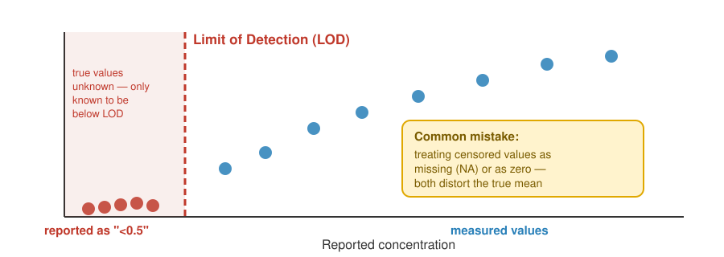
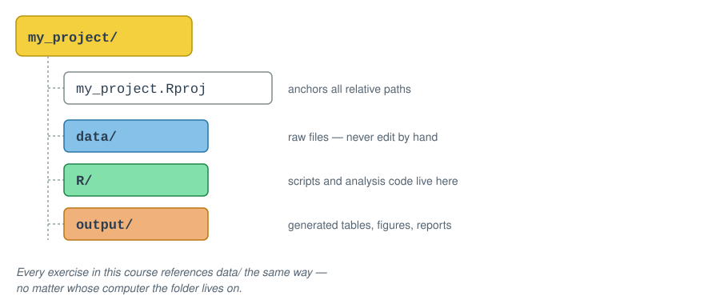

## Welcome to DS 100

- A short course on **data literacy**, **visualization**, and **computational thinking** for clinical laboratory professionals
- We'll use **RStudio and the tidyverse** exclusively — no Excel
- Designed to complement **MSACL 101** ("Breaking Up with Excel"), which teaches R syntax in depth
- This course focuses on the *mental models* — why you organize and think about data the way you do

<p class="lead">By the end of today: you'll think like a data-literate scientist before you write a single line of R.</p>

::: {.notes}
Frame this as a mental-model course, not a syntax course. Reassure trainees that heavy coding starts in Module 2, not now.
:::

---

## Module 1 Learning Objectives

By the end of this module, you will be able to:

- Distinguish common data types and explain why type matters for downstream analysis
- Identify whether a dataset follows tidy data principles — and articulate the tradeoffs
- Apply project and file organization principles for a reproducible analysis
- Recognize common data quality issues and their downstream consequences

<div class="pillars">
<div><h4>Types</h4><p>What can this value even do?</p></div>
<div><h4>Structure</h4><p>How easy is this to work with?</p></div>
<div><h4>Quality</h4><p>Can I trust this answer?</p></div>
<div><h4>Organization</h4><p>Can I repeat this in 6 months?</p></div>
</div>

---

## Before We Start: Orienting in RStudio

This module has **no R code** — but we'll still work inside RStudio.

Today, RStudio is simply a **text editor**: a place to open files, read them carefully, and record your answers.

1. Open the course project — double-click the `.Rproj` file
2. In the **Files** pane, open `updates_2026/exercises/module_1_exercises.qmd`
3. This file opens in the **Source** pane — you'll type your answers directly into it
4. Save often (Cmd/Ctrl+S) — nothing here runs or executes

> Getting oriented now — before anything needs to *run* — is what makes Module 2 feel easy instead of overwhelming.

::: {.notes}
Emphasize: opening the .Rproj first matters because it sets the working directory correctly for every later module. This is the seed that pays off in Module 2 when relative paths need to work.
:::

---

## Why RStudio — Even for a Non-Coding Module?

- One consistent home for course materials, exercises, and (soon) code
- The **Source** pane doubles as a plain-text and Markdown editor
- Getting comfortable navigating panes *before* you need to run anything lowers the stakes
- Module 2 will introduce RStudio as a *computational* tool — today is just geography

<div class="pillars">
<div><h4>Today</h4><p>RStudio as a text editor — read, navigate, record answers</p></div>
<div><h4>Module 2+</h4><p>RStudio as a computational tool — import, transform, visualize</p></div>
</div>

---

## 1.1 What Is Data? {background-color="#2c3e50"}

<p class="subtitle">Before we touch R, we need a shared vocabulary for what we're even looking at</p>

---

## What Is Data?

- **Data** = observations recorded systematically
- Every value in a dataset represents something measured, reported, or logged in the real world
- Two categories worth separating:
  - **Raw data** — recorded as originally captured (an instrument reading, a timestamp)
  - **Derived data** — calculated or transformed from raw values (a turnaround time, a mean)

> If you can't say what real-world event a value represents, you don't yet understand your data.

---

## Why Structure Matters — Before Any Analysis

- The same facts can be organized many different ways
- Structure determines:
  - What questions are *easy* to answer
  - What questions are *possible* to answer at all
  - How easily errors are introduced or hidden
- We'll return to this directly in section 1.3 (Tidy Data)

<p class="lead">Structure is a decision you make — not a fact about the data itself.</p>

---

## 1.2 Data Types {background-color="#2c3e50"}

<p class="subtitle">Six categories cover almost everything you'll encounter in clinical and MS data</p>

---

## Why Data Types Matter

A data type isn't just a technical label — it determines:

- What operations are valid (can you average it? sort it? subtract it?)
- How software will interpret ambiguous values
- Whether a value like `"NA"` means *missing* or literally the state of Nebraska

Misidentifying a type is one of the most common — and most silent — sources of analysis errors.

> A wrong data type doesn't crash your code. It just quietly gives you the wrong answer.

---

## Common Data Types

{fig-align="center" width="92%"}

::: {.notes}
Walk through each card briefly rather than reading it verbatim — ask learners to shout out which chem_data column they think matches each card.
:::

---

## A Special Case: Censored / Below-LOD Values

::: columns
::: {.column width="55%"}
- Clinical and MS data often contain values reported as **"<0.5"** or **"undetectable"**
- These are not missing — they are a special type: **censored data**
- The true value is known to be *somewhere below a threshold*, not unknown entirely
- Treating a censored value as missing (or worse, as zero) can distort every downstream summary statistic

::: {.callout-note}
We will not perform formal censored-data statistics in this course — but recognizing these values when you see them is essential data literacy.
:::
:::
::: {.column width="45%"}
{fig-align="center" width="100%"}
:::
:::

---

## Types in the Wild: A Raw CSV Row

```
121444,"Male",44,NA,2022-12-26 00:24:02,2022-12-26 01:58:16,
2022-12-26 03:42:19,NA,"unassigned","lopez","alanine_aminotransferase",17
```

- No column tells you the type — you have to infer it from the value and context
- `NA` appears twice, but for two different reasons
- The datetime has no explicit format label — R will have to be told how to read it (Module 2)

<p class="lead">Every column in this row is a small decision you'll have to make deliberately.</p>

---

## → Check-in 1A: Spot the Types {background-color="#8e44ad"}

<div class="badge">⏱ 10 minutes</div>

Open `chem_data.csv` in a plain text editor (not RStudio — a real text editor).

For each of the 13 columns, predict the data type and flag any concerns.

- Which columns look **numeric** vs. **categorical**?
- Where might **censored** or **missing** values be hiding?
- Which column will need an explicit **datetime format**?

*Return to `module_1_exercises.qmd` in RStudio to record your answers.*

---

## 1.3 Tidy Data Principles {background-color="#2c3e50"}

<p class="subtitle">The same facts, organized differently, can make an analysis easy or nearly impossible</p>

---

## Three Principles of Tidy Data

A dataset is **tidy** when:

1. Every **variable** has its own column
2. Every **observation** has its own row
3. Every **value** has its own cell

- Not a matter of taste — a precise, checkable definition
- Most tidyverse tools *assume* tidy input

> Tidy data isn't prettier data. It's data shaped for the tools you're about to use.

---

## The Same Facts, Two Structures

{fig-align="center" width="95%"}

Same information — very different shapes. Notice the explicit `NA` that appears only once the data is widened.

---

## Tradeoffs: Long vs. Wide

| | Long (tidy) | Wide |
|---|---|---|
| Add a new analyte | Add rows | Add a column, restructure |
| Filter by analyte | Easy (`filter()`) | Awkward |
| Human-readable summary table | Harder to scan | Easy to scan |
| Feed into `ggplot2` | Usually required | Usually needs reshaping first |

- **Neither format is "wrong"** — but one is almost always easier for a given task
- The tidyverse gives you tools (`pivot_longer()`, `pivot_wider()`) to convert between them — we'll see these in Module 4

---

## → Check-in 1B: Tidy or Not Tidy? {background-color="#8e44ad"}

<div class="badge">⏱ 8 minutes</div>

Compare `chem_data.csv` (long) and `chem_data_wide.csv` (wide).

Answer three written questions in `module_1_exercises.qmd`:

- Which tidy principle does the wide format bend?
- When is each format easier to use?
- What would you need to do to a wide file before analyzing it in R?

---

## 1.4 Data Quality and Common Pitfalls {background-color="#2c3e50"}

<p class="subtitle">Plausible-looking data is not the same thing as trustworthy data</p>

---

## Common Data Quality Issues

- **Missing values** — and knowing *why* they're missing (not tested vs. not applicable vs. lost)
- **Duplicate rows** — same observation recorded more than once
- **Out-of-range values** — a pH of 45, an age of 200
- **Encoding inconsistencies** — `"Male"` vs. `"M"` vs. `"male"` treated as three different categories
- **Timestamp errors** — a verify time earlier than the collect time

<p class="lead">Each of these can silently corrupt a downstream summary — often without any error message.</p>

---

## Why "Silent" Errors Are the Dangerous Ones

- Software rarely stops and warns you when data is *plausible but wrong*
- A mis-encoded category doesn't crash your analysis — it just quietly gets excluded, or double-counted
- This is exactly why Module 2 introduces a **validation checklist** as a required first step, every time you import data

> The most dangerous bugs are the ones that produce an answer — just the wrong one.

---

## 1.5 Project and File Organization {background-color="#2c3e50"}

<p class="subtitle">Reproducibility starts with where your files live, not with your code</p>

---

## A Simple, Durable Folder Structure

{fig-align="center" width="88%"}

- **`data/` is read-only, in spirit** — never overwrite or edit a raw file by hand
- The `.Rproj` file anchors all relative paths so your code works regardless of where the folder lives on disk

---

## Bringing It Together

<div class="pillars">
<div><h4>Data types</h4><p>Determine what's even <em>possible</em> to compute</p></div>
<div><h4>Tidy structure</h4><p>Determines what's <em>easy</em> to compute</p></div>
<div><h4>Data quality</h4><p>Determines whether your answer is <em>trustworthy</em></p></div>
<div><h4>File organization</h4><p>Determines whether your work is <em>repeatable</em></p></div>
</div>

<p class="lead">Four habits. Zero lines of R code. All essential before you ever open a script.</p>

---

## Coming Up: Module 2

- RStudio as a **computational** tool, not just a text editor
- Importing `chem_data.csv` with the tidyverse
- Correcting the types you predicted today
- A hands-on data validation checklist

<p class="lead"><strong>Bring your laptop, charged, with R and RStudio installed.</strong></p>
